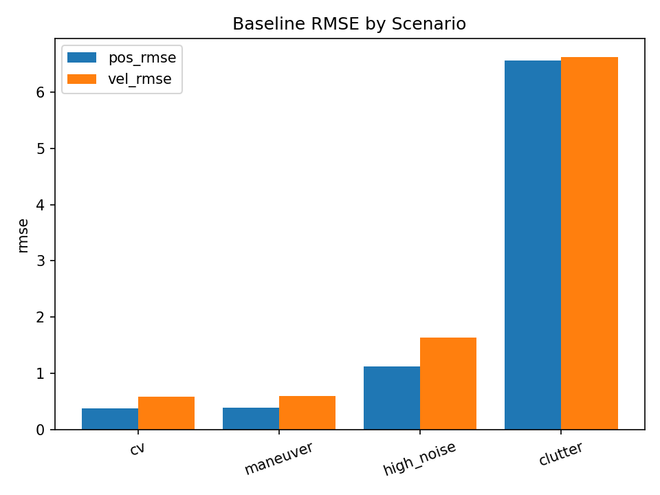
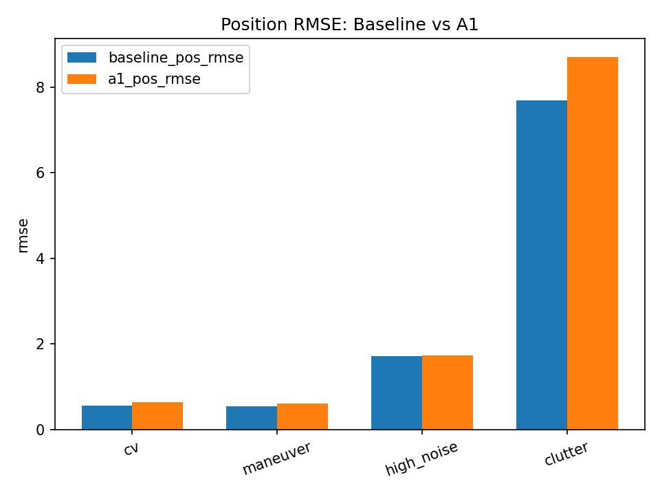
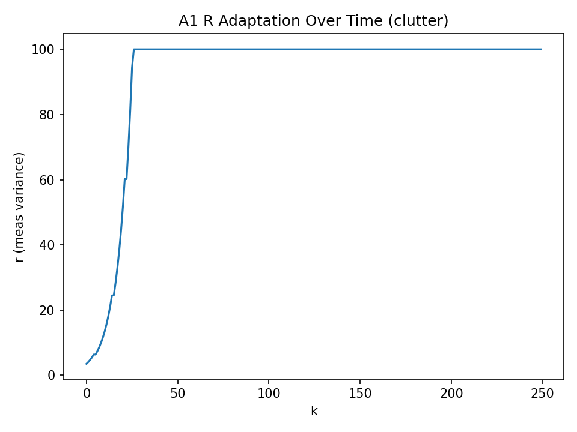

# Learning-Enhanced Tracking (C++17)

## Demo Output

Baseline RMSE by scenario:


Baseline vs A1 (Position RMSE):


A1 adaptive measurement noise (R) example (clutter):


Deterministic 2D tracking pipeline that will be extended with **learning-based adaptive noise tuning** (Kalman Q/R adaptation).
This repo is built as a systems-oriented autonomy/estimation demo: fixed timestep simulation, seeded RNG, CSV logging, and golden-hash smoke tests.

## Roadmap (Final AI Project)
- Dataset generator from sim (train/val/test CSV, deterministic)
- Baseline metrics (RMSE, NIS diagnostics, track loss)
- Learning module:
  - A1: Online statistical tuning via NIS control (deployable in C++)
  - A2: Small MLP to predict noise scaling from residual history (optional v2)
- Benchmark scenarios (CV, maneuver, high noise, clutter)
- Regression safety: smoke.sh + expected hashes

## Build (MSYS2 UCRT64)
```bash
cd /c/Users/AliEray/Desktop/Staj-Proje/learning-enhanced-tracking
cmake -S . -B build -G Ninja
cmake --build build -j